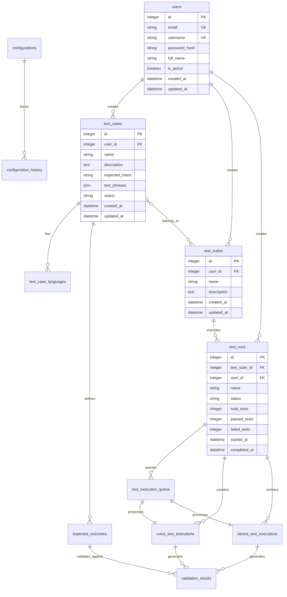

# Database Schema Documentation

**Voice AI Automated Testing Framework - Database Architecture**

This document provides comprehensive documentation of the database schema, including tables, relationships, fields, and constraints.

---

## Table of Contents

1. [Overview](#overview)
2. [Entity Relationship Diagram](#entity-relationship-diagram)
3. [Core Tables](#core-tables)
4. [Table Descriptions](#table-descriptions)
5. [Relationships](#relationships)
6. [Indexes and Performance](#indexes-and-performance)
7. [Constraints and Validation](#constraints-and-validation)
8. [Migration Strategy](#migration-strategy)

---

## Overview

The database schema supports a comprehensive voice AI testing framework with the following key components:

### Database System
- **DBMS**: PostgreSQL 14+
- **ORM**: SQLAlchemy 2.0
- **Migrations**: Alembic
- **Connection Pool**: 20 connections (configurable)

### Design Principles
- **Normalization**: 3NF (Third Normal Form) where appropriate
- **Soft Deletes**: Most tables support soft deletion
- **Timestamps**: All tables have `created_at` and `updated_at`
- **UUID Support**: Primary keys use integer IDs, but support UUID for external references
- **Audit Trail**: Configuration changes tracked in history tables

### Key Features
- User authentication and authorization
- Test case management with multi-language support
- Test suite organization
- Test run execution and queuing
- Voice and device-specific test execution
- Validation results and expected outcomes
- Configuration management with versioning

---

## Entity Relationship Diagram



---

## Core Tables

### Primary Tables
1. **users** - User accounts and authentication
2. **test_cases** - Individual test case definitions
3. **test_suites** - Collections of related test cases
4. **test_runs** - Execution instances of test suites
5. **expected_outcomes** - Expected results for test cases
6. **validation_results** - Actual test execution results

### Execution Tables
7. **test_execution_queue** - Queue for test execution
8. **voice_test_executions** - Voice-specific test executions
9. **device_test_executions** - Device-specific test executions

### Support Tables
10. **test_case_languages** - Multi-language test phrase variants
11. **configurations** - System configuration settings
12. **configuration_history** - Configuration change audit log

### Regression Tables
13. **regression_baselines** - Approved baseline snapshots for regression detection
14. **baseline_history** - Audit trail of baseline version changes
15. **regressions** - Persistent tracking of detected regressions with occurrence counting

---

## Table Descriptions

### 1. users

Stores user account information for authentication, authorization, and multi-tenancy.

| Field | Type | Constraints | Description |
|-------|------|-------------|-------------|
| id | UUID | PRIMARY KEY, DEFAULT gen_random_uuid() | Unique user identifier |
| email | VARCHAR(255) | UNIQUE, NOT NULL | User email address |
| username | VARCHAR(100) | UNIQUE, NOT NULL | Unique username |
| password_hash | VARCHAR(255) | NOT NULL | Bcrypt hashed password |
| full_name | VARCHAR(255) | NULLABLE | User's full name |
| role | VARCHAR(50) | NULLABLE | User role (super_admin, org_admin, admin, qa_lead, validator, viewer) |
| is_active | BOOLEAN | DEFAULT TRUE | Account active status |
| is_superuser | BOOLEAN | DEFAULT FALSE | Legacy admin flag (deprecated, use role) |
| tenant_id | UUID | NULLABLE, INDEX | Multi-tenant isolation - references organization owner's user.id |
| is_organization_owner | BOOLEAN | DEFAULT FALSE | Whether user owns an organization |
| organization_name | VARCHAR(255) | NULLABLE | Name of owned organization (if is_organization_owner=true) |
| language_proficiencies | JSON | NULLABLE | List of language codes user can validate |
| created_at | TIMESTAMP | DEFAULT NOW() | Account creation timestamp |
| updated_at | TIMESTAMP | DEFAULT NOW(), ON UPDATE NOW() | Last update timestamp |

**Multi-Tenancy Model**:
- **Organization Owners**: Users with `is_organization_owner=true` own an organization
- **Tenant ID**: For org owners, `tenant_id` is NULL; their `user.id` serves as the tenant_id for their members
- **Organization Members**: Regular users have `tenant_id` set to their organization owner's `user.id`
- **Effective Tenant ID**: Calculated as `user.tenant_id if user.tenant_id else user.id`
- **Super Admins**: Users with `role='super_admin'` can access all tenants

**Role Hierarchy**:
1. `super_admin` - Platform-wide access, manages all organizations
2. `org_admin` - Organization administrator, manages their org's users
3. `admin` - Full access within tenant
4. `qa_lead` - QA team lead, manages test execution
5. `validator` - Human validation tasks
6. `viewer` - Read-only access

**Indexes**:
- PRIMARY: `id`
- UNIQUE: `email`, `username`
- INDEX: `is_active`, `tenant_id`, `role`

**Relationships**:
- One-to-many with `test_cases` (user creates test cases)
- One-to-many with `test_suites` (user creates test suites)
- One-to-many with `test_runs` (user executes test runs)
- Self-referential: `tenant_id` points to organization owner's `id`

---

### 2. test_cases

Defines individual test cases for voice AI testing.

| Field | Type | Constraints | Description |
|-------|------|-------------|-------------|
| id | INTEGER | PRIMARY KEY, AUTO_INCREMENT | Unique test case identifier |
| user_id | INTEGER | FOREIGN KEY (users.id), NOT NULL | Creator user reference |
| name | VARCHAR(255) | NOT NULL | Test case name |
| description | TEXT | NULLABLE | Detailed description |
| expected_intent | VARCHAR(100) | NOT NULL | Expected AI intent to detect |
| test_phrases | JSON | NOT NULL | Array of test phrases |
| expected_entities | JSON | NULLABLE | Expected entities to extract |
| validation_rules | JSON | NULLABLE | Custom validation rules |
| status | VARCHAR(50) | DEFAULT 'active' | Status (active, archived, draft) |
| priority | INTEGER | DEFAULT 1 | Execution priority (1-5) |
| created_at | TIMESTAMP | DEFAULT NOW() | Creation timestamp |
| updated_at | TIMESTAMP | DEFAULT NOW(), ON UPDATE NOW() | Last update timestamp |
| deleted_at | TIMESTAMP | NULLABLE | Soft delete timestamp |

**Indexes**:
- PRIMARY: `id`
- FOREIGN KEY: `user_id` REFERENCES `users(id)`
- INDEX: `status`, `priority`, `user_id`
- INDEX: `created_at`, `deleted_at`

**Relationships**:
- Many-to-one with `users`
- One-to-many with `test_case_languages`
- One-to-many with `expected_outcomes`
- Many-to-many with `test_suites` (through junction table)

---

### 3. test_case_languages

Stores multi-language variants of test phrases for internationalization.

| Field | Type | Constraints | Description |
|-------|------|-------------|-------------|
| id | INTEGER | PRIMARY KEY, AUTO_INCREMENT | Unique record identifier |
| test_case_id | INTEGER | FOREIGN KEY (test_cases.id), NOT NULL | Parent test case |
| language_code | VARCHAR(10) | NOT NULL | ISO language code (en-US, es-ES) |
| test_phrases | JSON | NOT NULL | Localized test phrases |
| created_at | TIMESTAMP | DEFAULT NOW() | Creation timestamp |
| updated_at | TIMESTAMP | DEFAULT NOW(), ON UPDATE NOW() | Last update timestamp |

**Indexes**:
- PRIMARY: `id`
- FOREIGN KEY: `test_case_id` REFERENCES `test_cases(id)` ON DELETE CASCADE
- UNIQUE: `(test_case_id, language_code)`
- INDEX: `language_code`

**Relationships**:
- Many-to-one with `test_cases`

---

### 4. test_suites

Organizes related test cases into logical suites.

| Field | Type | Constraints | Description |
|-------|------|-------------|-------------|
| id | INTEGER | PRIMARY KEY, AUTO_INCREMENT | Unique suite identifier |
| user_id | INTEGER | FOREIGN KEY (users.id), NOT NULL | Creator user reference |
| name | VARCHAR(255) | NOT NULL | Suite name |
| description | TEXT | NULLABLE | Detailed description |
| tags | JSON | NULLABLE | Tags for categorization |
| is_active | BOOLEAN | DEFAULT TRUE | Suite active status |
| created_at | TIMESTAMP | DEFAULT NOW() | Creation timestamp |
| updated_at | TIMESTAMP | DEFAULT NOW(), ON UPDATE NOW() | Last update timestamp |
| deleted_at | TIMESTAMP | NULLABLE | Soft delete timestamp |

**Indexes**:
- PRIMARY: `id`
- FOREIGN KEY: `user_id` REFERENCES `users(id)`
- INDEX: `user_id`, `is_active`, `deleted_at`

**Relationships**:
- Many-to-one with `users`
- Many-to-many with `test_cases`
- One-to-many with `test_runs`

---

### 5. test_runs

Represents an execution instance of a test suite or collection of test cases.

| Field | Type | Constraints | Description |
|-------|------|-------------|-------------|
| id | INTEGER | PRIMARY KEY, AUTO_INCREMENT | Unique run identifier |
| test_suite_id | INTEGER | FOREIGN KEY (test_suites.id), NULLABLE | Associated test suite |
| user_id | INTEGER | FOREIGN KEY (users.id), NOT NULL | User who started the run |
| name | VARCHAR(255) | NOT NULL | Run name/description |
| status | VARCHAR(50) | DEFAULT 'queued' | Status (queued, running, completed, failed, cancelled) |
| total_tests | INTEGER | DEFAULT 0 | Total number of tests |
| completed_tests | INTEGER | DEFAULT 0 | Number of completed tests |
| passed_tests | INTEGER | DEFAULT 0 | Number of passed tests |
| failed_tests | INTEGER | DEFAULT 0 | Number of failed tests |
| skipped_tests | INTEGER | DEFAULT 0 | Number of skipped tests |
| configuration | JSON | NULLABLE | Run-specific configuration |
| environment | VARCHAR(50) | DEFAULT 'staging' | Target environment |
| created_at | TIMESTAMP | DEFAULT NOW() | Creation timestamp |
| started_at | TIMESTAMP | NULLABLE | Execution start time |
| completed_at | TIMESTAMP | NULLABLE | Execution completion time |
| updated_at | TIMESTAMP | DEFAULT NOW(), ON UPDATE NOW() | Last update timestamp |

**Indexes**:
- PRIMARY: `id`
- FOREIGN KEY: `test_suite_id` REFERENCES `test_suites(id)`
- FOREIGN KEY: `user_id` REFERENCES `users(id)`
- INDEX: `status`, `environment`, `user_id`
- INDEX: `created_at`, `started_at`, `completed_at`

**Relationships**:
- Many-to-one with `test_suites`
- Many-to-one with `users`
- One-to-many with `test_execution_queue`
- One-to-many with `voice_test_executions`
- One-to-many with `device_test_executions`

---

### 6. test_execution_queue

Manages the queue of tests to be executed.

| Field | Type | Constraints | Description |
|-------|------|-------------|-------------|
| id | INTEGER | PRIMARY KEY, AUTO_INCREMENT | Unique queue entry identifier |
| test_run_id | INTEGER | FOREIGN KEY (test_runs.id), NOT NULL | Associated test run |
| test_case_id | INTEGER | FOREIGN KEY (test_cases.id), NOT NULL | Test case to execute |
| priority | INTEGER | DEFAULT 1 | Execution priority (1-5) |
| status | VARCHAR(50) | DEFAULT 'pending' | Status (pending, processing, completed, failed) |
| retry_count | INTEGER | DEFAULT 0 | Number of retry attempts |
| max_retries | INTEGER | DEFAULT 3 | Maximum retry attempts |
| scheduled_at | TIMESTAMP | NULLABLE | Scheduled execution time |
| started_at | TIMESTAMP | NULLABLE | Execution start time |
| completed_at | TIMESTAMP | NULLABLE | Execution completion time |
| error_message | TEXT | NULLABLE | Error details if failed |
| created_at | TIMESTAMP | DEFAULT NOW() | Creation timestamp |
| updated_at | TIMESTAMP | DEFAULT NOW(), ON UPDATE NOW() | Last update timestamp |

**Indexes**:
- PRIMARY: `id`
- FOREIGN KEY: `test_run_id` REFERENCES `test_runs(id)` ON DELETE CASCADE
- FOREIGN KEY: `test_case_id` REFERENCES `test_cases(id)`
- INDEX: `status`, `priority`, `test_run_id`
- INDEX: `scheduled_at`, `started_at`

**Relationships**:
- Many-to-one with `test_runs`
- Many-to-one with `test_cases`
- One-to-one with `voice_test_executions`
- One-to-one with `device_test_executions`

---

### 7. voice_test_executions

Stores voice-specific test execution details.

| Field | Type | Constraints | Description |
|-------|------|-------------|-------------|
| id | INTEGER | PRIMARY KEY, AUTO_INCREMENT | Unique execution identifier |
| test_run_id | INTEGER | FOREIGN KEY (test_runs.id), NOT NULL | Associated test run |
| test_case_id | INTEGER | FOREIGN KEY (test_cases.id), NOT NULL | Test case executed |
| queue_id | INTEGER | FOREIGN KEY (test_execution_queue.id), NULLABLE | Queue entry reference |
| audio_file_url | VARCHAR(500) | NULLABLE | S3 URL of test audio |
| transcript | TEXT | NULLABLE | Speech-to-text transcript |
| detected_intent | VARCHAR(100) | NULLABLE | Detected AI intent |
| detected_entities | JSON | NULLABLE | Extracted entities |
| confidence_score | DECIMAL(5,4) | NULLABLE | Confidence score (0.0-1.0) |
| response_time_ms | INTEGER | NULLABLE | Response time in milliseconds |
| status | VARCHAR(50) | DEFAULT 'pending' | Execution status |
| error_message | TEXT | NULLABLE | Error details if failed |
| metadata | JSON | NULLABLE | Additional execution metadata |
| created_at | TIMESTAMP | DEFAULT NOW() | Creation timestamp |
| updated_at | TIMESTAMP | DEFAULT NOW(), ON UPDATE NOW() | Last update timestamp |

**Indexes**:
- PRIMARY: `id`
- FOREIGN KEY: `test_run_id` REFERENCES `test_runs(id)` ON DELETE CASCADE
- FOREIGN KEY: `test_case_id` REFERENCES `test_cases(id)`
- FOREIGN KEY: `queue_id` REFERENCES `test_execution_queue(id)`
- INDEX: `test_run_id`, `test_case_id`, `status`
- INDEX: `created_at`

**Relationships**:
- Many-to-one with `test_runs`
- Many-to-one with `test_cases`
- One-to-one with `test_execution_queue`
- One-to-many with `validation_results`

---

### 8. device_test_executions

Stores device-specific test execution details.

| Field | Type | Constraints | Description |
|-------|------|-------------|-------------|
| id | INTEGER | PRIMARY KEY, AUTO_INCREMENT | Unique execution identifier |
| test_run_id | INTEGER | FOREIGN KEY (test_runs.id), NOT NULL | Associated test run |
| test_case_id | INTEGER | FOREIGN KEY (test_cases.id), NOT NULL | Test case executed |
| queue_id | INTEGER | FOREIGN KEY (test_execution_queue.id), NULLABLE | Queue entry reference |
| device_type | VARCHAR(100) | NOT NULL | Device type (smartphone, smart speaker, etc.) |
| device_model | VARCHAR(100) | NULLABLE | Specific device model |
| os_version | VARCHAR(50) | NULLABLE | Operating system version |
| app_version | VARCHAR(50) | NULLABLE | Application version |
| detected_intent | VARCHAR(100) | NULLABLE | Detected AI intent |
| detected_entities | JSON | NULLABLE | Extracted entities |
| response_time_ms | INTEGER | NULLABLE | Response time in milliseconds |
| status | VARCHAR(50) | DEFAULT 'pending' | Execution status |
| error_message | TEXT | NULLABLE | Error details if failed |
| metadata | JSON | NULLABLE | Additional execution metadata |
| created_at | TIMESTAMP | DEFAULT NOW() | Creation timestamp |
| updated_at | TIMESTAMP | DEFAULT NOW(), ON UPDATE NOW() | Last update timestamp |

**Indexes**:
- PRIMARY: `id`
- FOREIGN KEY: `test_run_id` REFERENCES `test_runs(id)` ON DELETE CASCADE
- FOREIGN KEY: `test_case_id` REFERENCES `test_cases(id)`
- FOREIGN KEY: `queue_id` REFERENCES `test_execution_queue(id)`
- INDEX: `test_run_id`, `test_case_id`, `device_type`, `status`

**Relationships**:
- Many-to-one with `test_runs`
- Many-to-one with `test_cases`
- One-to-one with `test_execution_queue`
- One-to-many with `validation_results`

---

### 9. expected_outcomes

Defines expected outcomes for test case validation.

| Field | Type | Constraints | Description |
|-------|------|-------------|-------------|
| id | INTEGER | PRIMARY KEY, AUTO_INCREMENT | Unique outcome identifier |
| test_case_id | INTEGER | FOREIGN KEY (test_cases.id), NOT NULL | Associated test case |
| expected_intent | VARCHAR(100) | NOT NULL | Expected intent |
| expected_entities | JSON | NULLABLE | Expected entities |
| expected_response_pattern | TEXT | NULLABLE | Expected response pattern (regex) |
| min_confidence_score | DECIMAL(5,4) | DEFAULT 0.7 | Minimum acceptable confidence |
| max_response_time_ms | INTEGER | DEFAULT 5000 | Maximum acceptable response time |
| validation_rules | JSON | NULLABLE | Custom validation rules |
| created_at | TIMESTAMP | DEFAULT NOW() | Creation timestamp |
| updated_at | TIMESTAMP | DEFAULT NOW(), ON UPDATE NOW() | Last update timestamp |

**Indexes**:
- PRIMARY: `id`
- FOREIGN KEY: `test_case_id` REFERENCES `test_cases(id)` ON DELETE CASCADE
- INDEX: `test_case_id`

**Relationships**:
- Many-to-one with `test_cases`
- One-to-many with `validation_results`

---

### 10. validation_results

Stores validation results comparing actual vs expected outcomes.

| Field | Type | Constraints | Description |
|-------|------|-------------|-------------|
| id | INTEGER | PRIMARY KEY, AUTO_INCREMENT | Unique result identifier |
| voice_test_execution_id | INTEGER | FOREIGN KEY (voice_test_executions.id), NULLABLE | Voice execution reference |
| device_test_execution_id | INTEGER | FOREIGN KEY (device_test_executions.id), NULLABLE | Device execution reference |
| expected_outcome_id | INTEGER | FOREIGN KEY (expected_outcomes.id), NULLABLE | Expected outcome reference |
| is_passed | BOOLEAN | DEFAULT FALSE | Overall pass/fail status |
| intent_match | BOOLEAN | DEFAULT FALSE | Intent matched expected |
| entities_match | BOOLEAN | DEFAULT FALSE | Entities matched expected |
| confidence_acceptable | BOOLEAN | DEFAULT FALSE | Confidence score acceptable |
| response_time_acceptable | BOOLEAN | DEFAULT FALSE | Response time acceptable |
| validation_score | DECIMAL(5,4) | NULLABLE | Overall validation score (0.0-1.0) |
| discrepancies | JSON | NULLABLE | Details of validation failures |
| notes | TEXT | NULLABLE | Additional notes |
| created_at | TIMESTAMP | DEFAULT NOW() | Creation timestamp |
| updated_at | TIMESTAMP | DEFAULT NOW(), ON UPDATE NOW() | Last update timestamp |

**Indexes**:
- PRIMARY: `id`
- FOREIGN KEY: `voice_test_execution_id` REFERENCES `voice_test_executions(id)` ON DELETE CASCADE
- FOREIGN KEY: `device_test_execution_id` REFERENCES `device_test_executions(id)` ON DELETE CASCADE
- FOREIGN KEY: `expected_outcome_id` REFERENCES `expected_outcomes(id)`
- INDEX: `is_passed`, `validation_score`
- INDEX: `voice_test_execution_id`, `device_test_execution_id`

**Relationships**:
- Many-to-one with `voice_test_executions`
- Many-to-one with `device_test_executions`
- Many-to-one with `expected_outcomes`

---

### 11. configurations

Stores system configuration settings.

| Field | Type | Constraints | Description |
|-------|------|-------------|-------------|
| id | INTEGER | PRIMARY KEY, AUTO_INCREMENT | Unique configuration identifier |
| key | VARCHAR(255) | UNIQUE, NOT NULL | Configuration key |
| value | TEXT | NOT NULL | Configuration value (JSON or string) |
| data_type | VARCHAR(50) | DEFAULT 'string' | Value type (string, integer, boolean, json) |
| description | TEXT | NULLABLE | Configuration description |
| is_encrypted | BOOLEAN | DEFAULT FALSE | Whether value is encrypted |
| is_active | BOOLEAN | DEFAULT TRUE | Configuration active status |
| created_at | TIMESTAMP | DEFAULT NOW() | Creation timestamp |
| updated_at | TIMESTAMP | DEFAULT NOW(), ON UPDATE NOW() | Last update timestamp |

**Indexes**:
- PRIMARY: `id`
- UNIQUE: `key`
- INDEX: `is_active`

**Relationships**:
- One-to-many with `configuration_history`

---

### 12. configuration_history

Audit log of configuration changes.

| Field | Type | Constraints | Description |
|-------|------|-------------|-------------|
| id | INTEGER | PRIMARY KEY, AUTO_INCREMENT | Unique history identifier |
| configuration_id | INTEGER | FOREIGN KEY (configurations.id), NOT NULL | Configuration reference |
| user_id | INTEGER | FOREIGN KEY (users.id), NULLABLE | User who made the change |
| previous_value | TEXT | NULLABLE | Previous configuration value |
| new_value | TEXT | NOT NULL | New configuration value |
| change_reason | TEXT | NULLABLE | Reason for change |
| created_at | TIMESTAMP | DEFAULT NOW() | Change timestamp |

**Indexes**:
- PRIMARY: `id`
- FOREIGN KEY: `configuration_id` REFERENCES `configurations(id)` ON DELETE CASCADE
- FOREIGN KEY: `user_id` REFERENCES `users(id)` ON DELETE SET NULL
- INDEX: `configuration_id`, `created_at`

**Relationships**:
- Many-to-one with `configurations`
- Many-to-one with `users`

---

### 13. regression_baselines

Stores approved baseline snapshots for regression detection. Each scenario script has at most one active baseline that represents the "expected" behavior.

| Field | Type | Constraints | Description |
|-------|------|-------------|-------------|
| id | UUID | PRIMARY KEY, DEFAULT gen_random_uuid() | Unique baseline identifier |
| tenant_id | UUID | NULLABLE, INDEX | Multi-tenant isolation |
| script_id | VARCHAR(36) | UNIQUE, NOT NULL, INDEX | Scenario script UUID |
| result_status | VARCHAR(32) | NOT NULL | Baseline status (passed, failed, etc.) |
| metrics | JSON | NOT NULL, DEFAULT '{}' | Captured metrics snapshot |
| version | INTEGER | NOT NULL, DEFAULT 1 | Baseline version number |
| approved_by | VARCHAR(36) | NULLABLE | User ID who approved |
| approved_at | TIMESTAMP WITH TIME ZONE | NULLABLE | Approval timestamp |
| note | TEXT | NULLABLE | Approval note/reason |
| created_at | TIMESTAMP WITH TIME ZONE | NOT NULL, DEFAULT NOW() | Creation timestamp |
| updated_at | TIMESTAMP WITH TIME ZONE | NOT NULL, DEFAULT NOW() | Last update timestamp |

**Indexes**:
- PRIMARY: `id`
- UNIQUE: `script_id`
- INDEX: `tenant_id`

**Relationships**:
- One-to-many with `baseline_history` (archived versions)

---

### 14. baseline_history

Audit trail for baseline version changes. When a baseline is re-approved, the previous version is archived here for traceability.

| Field | Type | Constraints | Description |
|-------|------|-------------|-------------|
| id | UUID | PRIMARY KEY, DEFAULT gen_random_uuid() | Unique history identifier |
| tenant_id | UUID | NULLABLE, INDEX | Multi-tenant isolation |
| baseline_id | UUID | FOREIGN KEY (regression_baselines.id), NOT NULL | Parent baseline reference |
| script_id | VARCHAR(36) | NOT NULL, INDEX | Scenario script UUID (denormalized) |
| version | INTEGER | NOT NULL | Version number at time of archive |
| result_status | VARCHAR(32) | NOT NULL | Status at this version |
| metrics | JSON | NOT NULL, DEFAULT '{}' | Metrics at this version |
| approved_by | VARCHAR(36) | NULLABLE | User who approved this version |
| approved_at | TIMESTAMP WITH TIME ZONE | NULLABLE | Approval timestamp |
| note | TEXT | NULLABLE | Note for this version |
| created_at | TIMESTAMP WITH TIME ZONE | NOT NULL, DEFAULT NOW() | Archive timestamp |
| updated_at | TIMESTAMP WITH TIME ZONE | NOT NULL, DEFAULT NOW() | Last update timestamp |

**Indexes**:
- PRIMARY: `id`
- FOREIGN KEY: `baseline_id` REFERENCES `regression_baselines(id)` ON DELETE CASCADE
- UNIQUE: `(baseline_id, version)` - Ensures unique version per baseline
- INDEX: `baseline_id`, `script_id`, `tenant_id`

**Relationships**:
- Many-to-one with `regression_baselines`

---

### 15. regressions

Persistent tracking of detected regressions with occurrence counting and lifecycle management. Unlike ephemeral regression detection, this table maintains historical records of all regressions.

| Field | Type | Constraints | Description |
|-------|------|-------------|-------------|
| id | UUID | PRIMARY KEY, DEFAULT gen_random_uuid() | Unique regression identifier |
| tenant_id | UUID | NULLABLE, INDEX | Multi-tenant isolation |
| script_id | UUID | FOREIGN KEY (scenario_scripts.id), NOT NULL, INDEX | Scenario script where regression was detected |
| category | VARCHAR(50) | NOT NULL | Regression category: 'status', 'metric', or 'llm' |
| severity | VARCHAR(50) | NOT NULL, DEFAULT 'medium' | Severity: 'low', 'medium', 'high', 'critical' |
| status | VARCHAR(50) | NOT NULL, DEFAULT 'active' | Status: 'active', 'investigating', 'resolved', 'ignored' |
| baseline_version | INTEGER | NULLABLE | Version of baseline used for detection |
| detection_date | TIMESTAMP WITH TIME ZONE | NOT NULL | When the regression was first detected |
| resolution_date | TIMESTAMP WITH TIME ZONE | NULLABLE | When the regression was resolved |
| last_seen_date | TIMESTAMP WITH TIME ZONE | NOT NULL | Most recent occurrence of this regression |
| occurrence_count | INTEGER | NOT NULL, DEFAULT 1 | Number of times this regression has been detected |
| details | JSONB | NOT NULL, DEFAULT '{}' | Regression-specific data (baseline values, current values, deltas, messages) |
| linked_defect_id | UUID | FOREIGN KEY (defects.id), NULLABLE, INDEX | Defect created to track this regression |
| resolved_by | UUID | FOREIGN KEY (users.id), NULLABLE | User who resolved this regression |
| resolution_note | TEXT | NULLABLE | Note explaining how regression was resolved |
| created_at | TIMESTAMP WITH TIME ZONE | NOT NULL, DEFAULT NOW() | Record creation timestamp |
| updated_at | TIMESTAMP WITH TIME ZONE | NOT NULL, DEFAULT NOW() | Record last update timestamp |

**Regression Categories**:
- **status**: Test status regression (pass → fail)
- **metric**: Deterministic metric degradation (command_kind_match, asr_confidence, etc.)
- **llm**: LLM final verdict change (advisory only, not individual scores)

**Status Lifecycle**:
- **active**: Regression detected and not yet addressed
- **investigating**: Defect created, investigation in progress
- **resolved**: Manually resolved or auto-resolved when test passes
- **ignored**: Acknowledged but intentionally not fixed

**Severity Determination**:
- **critical**: Major status regression or >20% metric degradation
- **high**: Status regression or >10% metric degradation
- **medium**: LLM verdict changes, moderate metric degradation
- **low**: Minor metric degradation (<10%)

**Occurrence Tracking**:
- First detection creates new record with `occurrence_count=1`
- Subsequent detections increment `occurrence_count` and update `last_seen_date`
- Helps identify persistent vs intermittent issues

**Auto-Resolution**:
- When a test passes successfully, all active regressions for that script are auto-resolved
- Resolution date set to test pass time, resolved_by remains NULL for auto-resolution

**Indexes**:
- PRIMARY: `id`
- FOREIGN KEY: `script_id` REFERENCES `scenario_scripts(id)` ON DELETE CASCADE
- FOREIGN KEY: `linked_defect_id` REFERENCES `defects(id)` ON DELETE SET NULL
- FOREIGN KEY: `resolved_by` REFERENCES `users(id)` ON DELETE SET NULL
- INDEX: `status` - Fast filtering by status
- INDEX: `category` - Fast filtering by category
- INDEX: `detection_date` - Time-based queries
- INDEX: `(script_id, status)` - Composite for per-scenario active regressions

**Relationships**:
- Many-to-one with `scenario_scripts` (script that regressed)
- Many-to-one with `defects` (optional linked defect)
- Many-to-one with `users` (user who resolved)

**Example Details JSON** (status regression):
```json
{
  "baseline_status": "passed",
  "current_status": "failed",
  "message": "Test status regressed from passed to failed"
}
```

**Example Details JSON** (metric regression):
```json
{
  "metric": "command_kind_match",
  "baseline_value": 1.0,
  "current_value": 0.75,
  "change": -0.25,
  "change_pct": -25.0,
  "message": "command_kind_match degraded by 25.0%"
}
```

**Example Details JSON** (LLM regression):
```json
{
  "baseline_verdict": "pass",
  "current_verdict": "fail",
  "message": "LLM verdict changed from pass to fail (advisory)"
}
```

---

## Relationships

### One-to-Many Relationships

1. **users → test_cases**: One user creates many test cases
2. **users → test_suites**: One user creates many test suites
3. **users → test_runs**: One user initiates many test runs
4. **test_cases → test_case_languages**: One test case has many language variants
5. **test_cases → expected_outcomes**: One test case has many expected outcomes
6. **test_suites → test_runs**: One test suite can be run multiple times
7. **test_runs → test_execution_queue**: One test run queues many test executions
8. **test_runs → voice_test_executions**: One test run contains many voice executions
9. **test_runs → device_test_executions**: One test run contains many device executions
10. **configurations → configuration_history**: One configuration has many history entries
11. **regression_baselines → baseline_history**: One baseline has many archived history entries
12. **scenario_scripts → regressions**: One scenario can have many detected regressions
13. **defects → regressions**: One defect can be linked to many regressions (typically one-to-one)
14. **users → regressions**: One user can resolve many regressions

### Many-to-Many Relationships

1. **test_cases ↔ test_suites**: Test cases can belong to multiple suites, suites contain multiple test cases (through junction table)

### One-to-One Relationships

1. **test_execution_queue ↔ voice_test_executions**: One queue entry processes one voice execution
2. **test_execution_queue ↔ device_test_executions**: One queue entry processes one device execution

---

## Indexes and Performance

### Primary Indexes
- All tables have PRIMARY KEY on `id` field
- Automatically indexed by database

### Unique Indexes
- `users.email`, `users.username`
- `configurations.key`
- `test_case_languages(test_case_id, language_code)` composite

### Foreign Key Indexes
- All foreign key columns are indexed automatically
- Improves JOIN performance

### Custom Indexes

#### Status and State Indexes
```sql
CREATE INDEX idx_test_cases_status ON test_cases(status);
CREATE INDEX idx_test_runs_status ON test_runs(status);
CREATE INDEX idx_queue_status ON test_execution_queue(status);
```

#### Timestamp Indexes
```sql
CREATE INDEX idx_test_runs_dates ON test_runs(created_at, started_at, completed_at);
CREATE INDEX idx_executions_created ON voice_test_executions(created_at);
```

#### Composite Indexes for Common Queries
```sql
CREATE INDEX idx_test_runs_user_status ON test_runs(user_id, status);
CREATE INDEX idx_queue_run_status ON test_execution_queue(test_run_id, status);
```

### Performance Considerations

- **Pagination**: Use `OFFSET` and `LIMIT` with indexed columns
- **Filtering**: Filter on indexed columns (status, user_id, created_at)
- **Sorting**: Sort by indexed columns for better performance
- **JOINs**: Foreign keys are indexed, JOINs are efficient
- **JSON Queries**: Consider PostgreSQL JSON indexes for frequent JSON field queries

---

## Constraints and Validation

### Primary Key Constraints
- All tables use auto-incrementing INTEGER primary keys
- Ensures unique identification of records

### Foreign Key Constraints
- **ON DELETE CASCADE**: Used for dependent data (e.g., test_execution_queue)
- **ON DELETE SET NULL**: Used for optional references (e.g., configuration_history.user_id)
- **ON DELETE RESTRICT**: Default, prevents deletion if references exist

### Unique Constraints
- `users.email` - Ensures unique email addresses
- `users.username` - Ensures unique usernames
- `configurations.key` - Ensures unique configuration keys
- `test_case_languages(test_case_id, language_code)` - One language variant per test case

### Check Constraints
```sql
ALTER TABLE validation_results
ADD CONSTRAINT chk_validation_score
CHECK (validation_score >= 0.0 AND validation_score <= 1.0);

ALTER TABLE expected_outcomes
ADD CONSTRAINT chk_min_confidence
CHECK (min_confidence_score >= 0.0 AND min_confidence_score <= 1.0);

ALTER TABLE test_runs
ADD CONSTRAINT chk_test_counts
CHECK (total_tests >= 0 AND passed_tests >= 0 AND failed_tests >= 0);
```

### NOT NULL Constraints
- Critical fields marked as NOT NULL
- Ensures data integrity

### Default Values
- `created_at`: DEFAULT NOW()
- `updated_at`: DEFAULT NOW()
- `is_active`: DEFAULT TRUE
- `status`: Appropriate default for each table

---

## Migration Strategy

### Alembic Migrations

All schema changes are managed through Alembic migrations:

1. **Create Migration**:
   ```bash
   alembic revision --autogenerate -m "Add new table"
   ```

2. **Review Migration**: Always review auto-generated migrations in `alembic/versions/`

3. **Apply Migration**:
   ```bash
   alembic upgrade head
   ```

4. **Rollback** (if needed):
   ```bash
   alembic downgrade -1
   ```

### Migration Best Practices

- **Backward Compatible**: Ensure migrations don't break existing code
- **Data Migration**: Include data migration scripts when schema changes
- **Testing**: Test migrations on staging before production
- **Rollback Plan**: Always have a rollback strategy
- **Versioning**: Use semantic versioning in migration messages

### Common Migration Patterns

#### Adding Column (Backward Compatible)
```python
def upgrade():
    op.add_column('test_cases',
        sa.Column('priority', sa.Integer(), nullable=True, server_default='1'))
```

#### Renaming Column (Requires Data Migration)
```python
def upgrade():
    op.alter_column('test_cases', 'old_name', new_column_name='new_name')
```

#### Adding Foreign Key
```python
def upgrade():
    op.create_foreign_key(
        'fk_test_cases_user_id',
        'test_cases', 'users',
        ['user_id'], ['id'],
        ondelete='CASCADE'
    )
```

---

## Additional Resources

- **SQLAlchemy Documentation**: https://docs.sqlalchemy.org/
- **Alembic Documentation**: https://alembic.sqlalchemy.org/
- **PostgreSQL Documentation**: https://www.postgresql.org/docs/
- **Database Design Guide**: See `docs/architecture.md`
- **API Documentation**: See `docs/api-guide.md`

---

**Database Version**: 1.1
**Last Updated**: 2025-12-26
**Maintained By**: Development Team

For questions about the database schema, please contact the backend team or create an issue in the GitHub repository.
